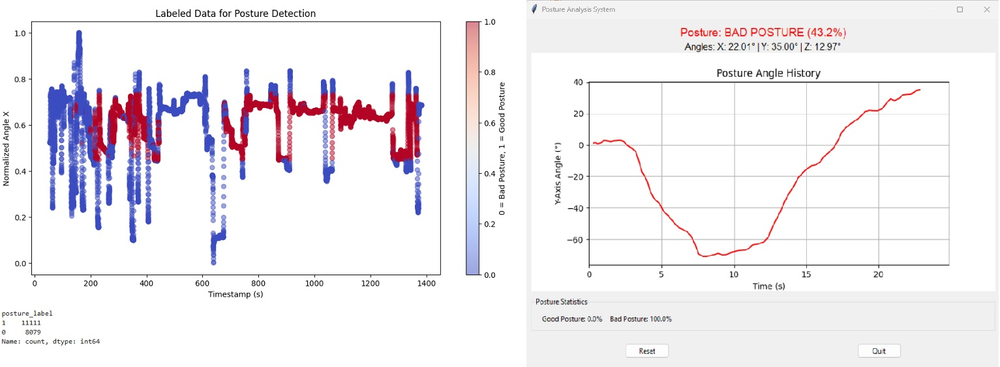
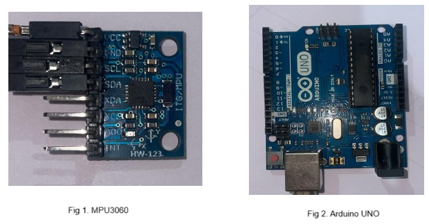
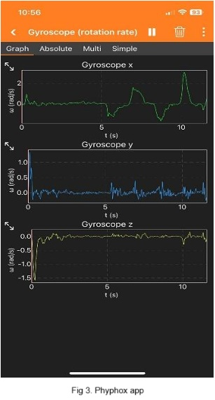

# IoT-Based Posture Monitoring and Spinal Pain Prediction Using Deep Learning

## Overview

This project implements a real-time posture monitoring and spinal pain prediction system using IoT wearable sensors and deep learning techniques. An MPU6050 sensor (accelerometer + gyroscope) mounted on the upper back collects motion data which is processed via a CNN-LSTM model to predict the probability of spinal discomfort. The system provides instant posture feedback and alerts, helping users maintain healthy posture and prevent musculoskeletal issues.

The solution includes:

- Real-time sensor data acquisition with MPU6050 and Phyphox app
- Data preprocessing and feature extraction
- Training and deployment of a CNN-LSTM deep learning model for posture classification (Good/Bad)
- A Python Tkinter-based GUI for live posture monitoring and alerts
- Historical posture trend visualization and pain prediction

---

## Features

- Non-intrusive wearable posture corrector using MPU6050
- High-frequency sensor data (50Hz) for detailed movement capture
- Hybrid CNN-LSTM deep learning architecture for posture classification and pain prediction
- Real-time alerts after sustained poor posture detection (15 seconds threshold)
- No cameras or continuous user inputs required
- Personalized monitoring adaptable to users’ movement patterns
- Supports sitting, standing, and walking activity monitoring
---
## Hardware & Software
- **Hardware**: MPU6050 (3-axis accelerometer + gyroscope) mounted on upper back, smartphone/PC for data logging
  
	

- **Software**: 
  - Python for data processing and model training
  - TensorFlow/Keras for building and training CNN-LSTM models
  - Tkinter for GUI and live posture visualization
  - Phyphox app for sensor data collection (alternative data source)

	

---

## Installation

1. Clone the repository:

		git clone https://github.com/shivamds12/Posture-Monitoring-and-Spinal-Pain-Prediction
		cd posture-monitoring

2. Install Python dependencies:

		pip install -r requirements.txt

Required packages include:
- numpy
- tensorflow
- matplotlib
- tkinter (usually pre-installed, for GUI)
- pandas (optional, for data handling)

---

## Usage

1. Connect the MPU6050 sensor via Ardiuno Board or start data collection using Phyphox app.
2. Launch the Python script for live monitoring:

		python REAL_TIME_PREDICATION_USING_MPU3060.ipynb

3. The GUI shows live sensor readings, posture angle graphs, and classification results.
4. Alerts will be triggered when bad posture persists longer than the configured threshold.
5. Posture data is logged for trend analysis and spinal pain prediction.

---

## Model Details

- The LSTM-based model takes segmented time-series data (sequence length × features) as input.
- Trained model saved as `lstm_posture_model.h5`

---

## Limitations and Future Work

- Dataset limited to a small prototype group; needs broader user trials to improve generalization.
- Sensor placement inconsistencies can impact data quality.
- Environmental noise and device calibration may affect accuracy.
- Future plans: integrate EMG sensors for muscle activity, enhance multi-sensor fusion, refine prediction models.

---

## Dataset

- Data collected from 4 participants over 40 sessions during daily activities (sitting, standing, walking) for 2 weeks
- Sampling rate: 50 Hz
- Raw, unprocessed time-series sensor data available for analysis
- Dataset repository: [Mendeley Data DOI: [10.17632/ftn4rjnd6x.1](https://data.mendeley.com/datasets/ftn4rjnd6x/1)]
